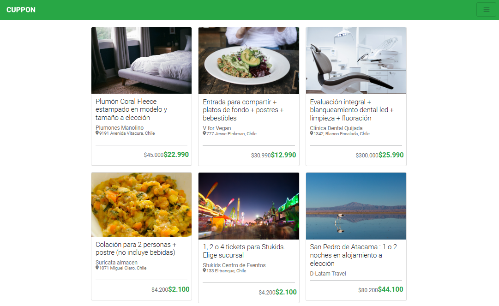
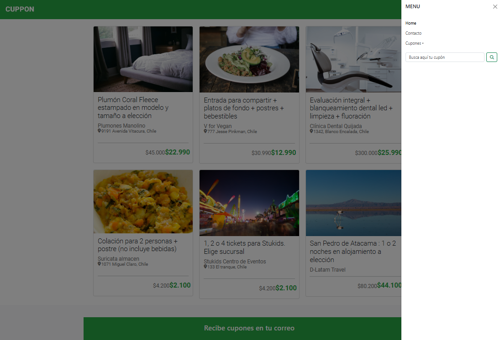

# **BASIC TEMPLATE WITH AN COUPON THEME**

## **Description**
This template applies Bootstrap classes through the navbar and container components to customize the site. It also uses a grid system and defines components and forms.

## **Technologies Used**
HTML5, CSS3, Bootstrap 5

## **Features**
- Construction of a responsive layout, considering Mobile First.
- Use of HTML and CSS.
- Implementation of Bootstrap and integration of its libraries.
- Use of Viewport to control the dimensions and scaling of the page.
- Use of Bootstrap grid and cards.

## Screenshots
<p align="center">
  
</p>
<p align="center">
  
</p>
<p align="center">
  
</p>


## Installation
1. Clone the repository
   ```bash
   git clone  https://github.com/yadicep/basic_template_coupon.git
